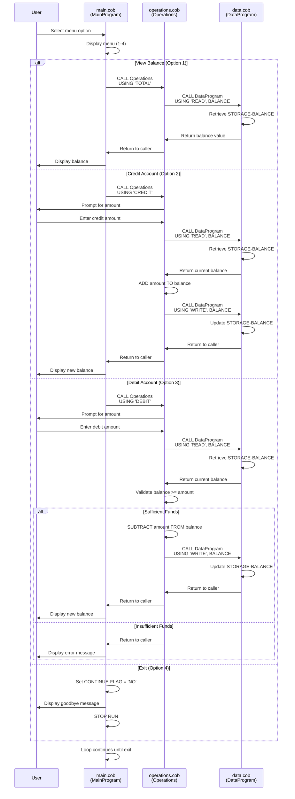

# COBOL Student Account Management System

## Overview

This documentation describes the COBOL-based Student Account Management System, a legacy application responsible for managing student account balances. The system provides core functionality for viewing account balances and performing credit and debit transactions.

---

## COBOL Program Documentation

### 1. **main.cob** - MainProgram

#### Purpose
The main entry point for the Student Account Management System. It provides an interactive menu-driven interface that allows users to select operations for managing student accounts.

#### Key Functions
- **Menu Display**: Presents a user-friendly menu with four options
- **User Input Processing**: Accepts user choice (1-4) via keyboard input
- **Operation Routing**: Dispatches the user's selection to the appropriate operation by calling the `Operations` program
- **Program Control Flow**: Maintains a loop until the user selects the exit option

#### Business Logic
- **Option 1 - View Balance**: Queries the current account balance
- **Option 2 - Credit Account**: Deposits funds into the student account
- **Option 3 - Debit Account**: Withdraws funds from the student account
- **Option 4 - Exit**: Gracefully terminates the program

#### Key Variables
| Variable | Type | Purpose |
|----------|------|---------|
| `USER-CHOICE` | Numeric (9) | Stores the user's menu selection |
| `CONTINUE-FLAG` | String (X(3)) | Controls the main execution loop |

#### Business Rules
- Users must select valid options (1-4); invalid selections are rejected with an error message
- The program continues looping until option 4 (Exit) is selected
- All operations are routed through the `Operations` module

---

### 2. **operations.cob** - Operations

#### Purpose
The business logic layer that processes account transactions. It handles three core operations: balance retrieval, credit transactions, and debit transactions. This program acts as an intermediary between the user interface (`main.cob`) and the data layer (`data.cob`).

#### Key Functions
- **Balance Retrieval (TOTAL)**: Fetches and displays the current account balance
- **Credit Processing (CREDIT)**: Accepts a deposit amount, updates the balance, and persists the change
- **Debit Processing (DEBIT)**: Accepts a withdrawal amount, validates sufficient funds, and processes the transaction
- **Data Persistence**: Calls the DataProgram for reading and writing account balances

#### Business Logic

##### Balance Retrieval (TOTAL Operation)
- Calls `DataProgram` with 'READ' operation to fetch the current balance
- Displays the current balance to the user

##### Credit Operation
1. Prompts user to enter the credit amount
2. Reads the current balance from storage
3. Adds the credit amount to the balance
4. Writes the updated balance back to storage
5. Displays the new balance to the user

##### Debit Operation
1. Prompts user to enter the debit amount
2. Reads the current balance from storage
3. **Validates** that the account has sufficient funds (balance ≥ debit amount)
4. If funds are available:
   - Subtracts the debit amount from the balance
   - Writes the updated balance to storage
   - Displays the new balance to the user
5. If insufficient funds:
   - Rejects the transaction
   - Displays an error message
   - Does not modify the account balance

#### Key Variables
| Variable | Type | Purpose |
|----------|------|---------|
| `OPERATION-TYPE` | String (X(6)) | Stores the operation to be performed |
| `AMOUNT` | Decimal (9(6)V99) | Holds transaction amounts |
| `FINAL-BALANCE` | Decimal (9(6)V99) | Maintains the current account balance |
| `PASSED-OPERATION` | String (X(6)) | Receives the operation from the caller |

#### Business Rules
- **Overdraft Protection**: Debit transactions are rejected if the resulting balance would be negative
- **Transaction Validation**: Only valid operations ('TOTAL', 'CREDIT', 'DEBIT') are processed
- **Data Consistency**: All balance modifications are immediately persisted to storage
- **Starting Balance**: The default account balance is $1,000.00

---

### 3. **data.cob** - DataProgram

#### Purpose
The data persistence layer responsible for managing account balance storage. This program provides a simple data interface with read and write operations, ensuring data consistency across transactions.

#### Key Functions
- **Read Operation (READ)**: Retrieves the current student account balance from internal storage
- **Write Operation (WRITE)**: Updates and persists the student account balance

#### Business Logic

##### Read Operation
- Retrieves the stored balance value (`STORAGE-BALANCE`)
- Passes the balance to the calling program via the `BALANCE` parameter
- Does not modify any stored data

##### Write Operation
- Receives a new balance value from the calling program
- Updates the internal `STORAGE-BALANCE` variable
- Persists the change for subsequent transactions

#### Key Variables
| Variable | Type | Purpose |
|----------|------|---------|
| `STORAGE-BALANCE` | Decimal (9(6)V99) | Persistent storage of the account balance |
| `OPERATION-TYPE` | String (X(6)) | Identifies the operation (READ or WRITE) |
| `PASSED-OPERATION` | String (X(6)) | Receives the operation from the caller |
| `BALANCE` | Decimal (9(6)V99) | Parameter for reading/writing balance values |

#### Business Rules
- **Initial Balance**: All accounts start with a balance of $1,000.00
- **Single Account**: The system manages one student account per session
- **Data Isolation**: Balance data is stored in working storage and is reset each session
- **No Validation**: The DataProgram does not validate transaction amounts; validation is performed at the operations layer

---

## System Architecture

```
┌─────────────────────────────────────────────────────┐
│  main.cob (MainProgram)                             │
│  - User Interface / Menu Display                    │
│  - Input/Output Handler                             │
└──────────────────┬──────────────────────────────────┘
                   │
                   │ CALL 'Operations'
                   │
┌──────────────────▼──────────────────────────────────┐
│  operations.cob (Operations)                        │
│  - Business Logic & Transaction Processing          │
│  - Balance Validation                               │
│  - Operation Routing                                │
└──────────────────┬──────────────────────────────────┘
                   │
                   │ CALL 'DataProgram'
                   │
┌──────────────────▼──────────────────────────────────┐
│  data.cob (DataProgram)                             │
│  - Data Persistence                                 │
│  - Balance Storage & Retrieval                      │
└─────────────────────────────────────────────────────┘
```

---

## Business Rules Summary

### Account Management Rules
1. **Initial Balance**: Each student account begins with $1,000.00
2. **Overdraft Protection**: The system prevents any transaction that would result in a negative balance
3. **Transaction Logging**: All successful transactions immediately update the account balance
4. **Balance Visibility**: Students can view their current balance at any time

### Transaction Rules
- **Credit Transactions**: Deposits are always accepted and immediately applied
- **Debit Transactions**: Withdrawals are only processed if sufficient funds are available
- **Transaction Amount Limits**: The system supports amounts up to $999,999.99 (6-digit whole numbers with 2 decimal places)

### Data Rules
- **Persistence**: All balance changes are immediately written to storage
- **Session Scope**: Balance data is maintained for the duration of the session
- **No Archiving**: Historical transaction records are not maintained

---

## Starting the System

1. Compile and link all three COBOL programs
2. Execute the `MainProgram` to start the interactive menu
3. Follow the on-screen prompts to perform account operations

---

## Future Modernization Considerations

- **Database Integration**: Replace in-memory storage with persistent database records
- **Multi-Account Support**: Extend system to manage multiple student accounts
- **Transaction History**: Implement audit trail and transaction logging
- **Error Handling**: Add comprehensive error codes and recovery mechanisms
- **Regulatory Compliance**: Add balance verification and reconciliation features
- **Modern Interface**: Migrate to web-based or modern cloud-native architecture

---

## System Data Flow - Sequence Diagram

The following diagram illustrates the interaction and data flow between the three COBOL programs for each type of operation:



### Key Data Flow Points

1. **Menu Selection**: User input flows from MainProgram to determine which operation to execute
2. **Operation Dispatch**: MainProgram passes the operation type to Operations
3. **Balance Retrieval**: Operations queries DataProgram to fetch current balance using READ operation
4. **Amount Input**: Operations accepts transaction amounts directly from the user
5. **Calculation**: Operations performs balance adjustments (addition for credits, subtraction for debits)
6. **Validation**: Operations validates sufficient funds before processing debit transactions
7. **Balance Update**: Operations writes the new balance back to DataProgram using WRITE operation
8. **Result Display**: MainProgram displays transaction results or error messages to the user
9. **Loop Control**: MainProgram maintains the menu loop until user selects exit